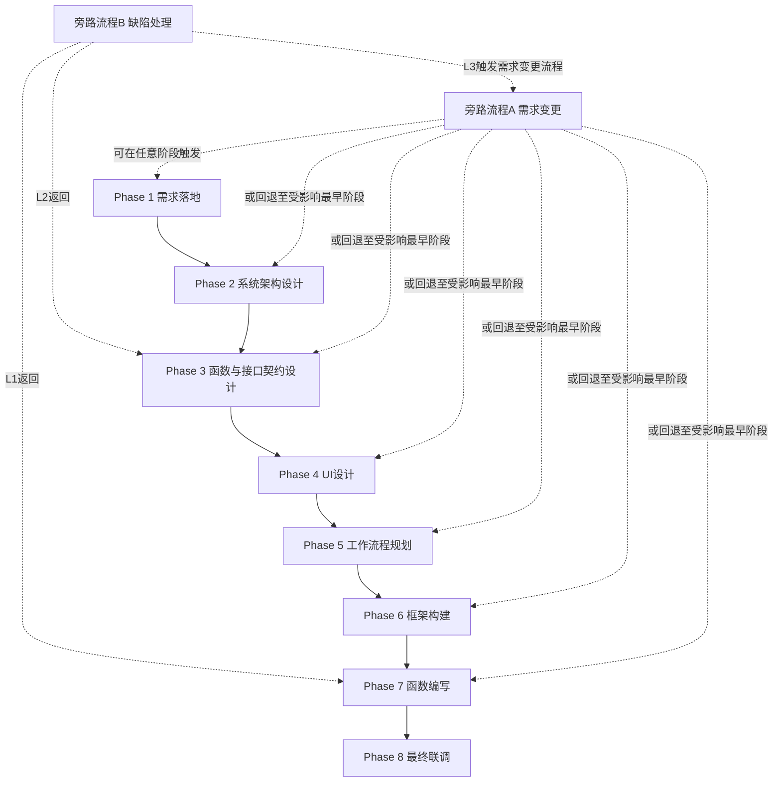

**作者提出了一种改进的，基于分解树的架构。可能近期会更新文档2.0版本。具体参见 docs/Tree-Centered Implementation Refinement.md**

# 多Agent协作开发架构

## 第0章：前置说明

**写作目的**：本文档面向 AI 系统架构师、Agent 框架开发者及技术决策者，描述一套面向企业软件研发落地的多 Agent 协作开发架构。本文重点讨论其流程设计、阶段门控、并行策略与关键机制，用于方案沟通、架构评审与后续原型实现参考

---

## 第1章：执行摘要（Executive Summary）

### 1.1 一句话定义
本文提出了一种 **Git-native、阶段门控、契约前置、分身并行** 的多 Agent 协作开发架构，通过 **将软件研发流程拆解为若干可审查、可追溯、可回退的阶段**，解决当前 Agent 开发流程中 **返工成本高、上下文污染严重、状态不可追溯、并行开发易失控** 的问题。

### 1.2 核心创新点
- **阶段门控机制**：将开发流程拆为 8 个主阶段与 2 个旁路流程，前一阶段交付物未锁定，后一阶段不得进入。
- **契约前置机制**：在进入编码前先完成函数与接口契约设计，为后续强解耦和大规模并行开发提供边界。
- **分身并行机制**：在函数编写阶段将同一角色拆分为多个分身，以函数或小粒度任务为单位并行推进。
- **经验串行机制**：经验只在批次间沉淀与传递，不在同批次实时扩散，从而降低上下文污染。
- **Git-native 状态管理**：以 Git 分支、提交、临时工作区和阶段工件作为核心状态载体，而非依赖长上下文会话保存系统状态。
- **旁路治理机制**：通过需求变更流程与缺陷处理流程，将“用户改变需求”和“系统内部质量问题”分开治理，避免无差别返工。

### 1.3 适用场景与不适用场景
**适用场景**：
- 中大型项目或中长周期项目
- 前后端协作明显、接口依赖复杂的项目
- 对开发成本、返工成本和过程可追溯性敏感的场景
- 需要多 Agent 分工协作而非单 Agent 长上下文完成的项目

**不适用场景**：
- 一次性脚本、小型 demo、极短周期原型
- 需求高度摇摆且不愿进行前置设计的场景
- 任务边界极其模糊、难以沉淀契约与工件的探索性试验

---

## 第2章：问题背景与动机（Problem & Motivation）

### 2.1 当前 Agent 开发流程的痛点
当前许多 Agent 开发方式更接近“长对话驱动编码”，其主要问题并不在于模型能力不足，而在于过程缺乏结构化约束。常见问题包括：

- **需求未收敛就直接进入实现**：用户常在需求尚不清晰时开始开发，最终导致大规模返工。
- **设计与实现耦合过深**：系统架构、接口设计、UI 设计和代码实现混在一起推进，使后续修改代价迅速增大。
- **上下文污染严重**：单个 Agent 在长上下文中同时处理需求、设计、编码、调试等任务，容易出现状态混乱和指令漂移。
- **并行开发缺乏边界**：多个 Agent 同时写代码时，若缺少契约、依赖图和合并规则，很容易相互覆盖或产生隐性冲突。
- **状态不可追溯**：大量关键决策只存在于对话中，难以通过版本系统准确追踪每一步的输入、输出与修改原因。

### 2.2 现有解决方案的局限
现有多 Agent 框架在“角色拆分”上通常已具备一定能力，但在“工程治理”上仍有明显不足：

- 多数方案强调角色协作，但缺乏严格阶段门控，导致角色虽然不同，流程仍然松散。
- 多数方案依赖会话状态或内存状态维持上下文，长期项目中追溯性较弱。
- 多数方案虽支持任务并行，但并行粒度通常停留在角色级或任务级，对函数级开发边界控制不够细。
- 对需求变更和缺陷修复常缺乏单独治理机制，导致所有问题都只能通过“继续修改”来处理。

### 2.3 本文的解决思路
为解决上述问题，本文提出一种以工程过程为中心而非以对话为中心的多 Agent 架构。其核心思路是：

1. **先收敛需求，再设计架构与契约，再进入实现**；
2. **用阶段工件替代模糊上下文，用 Git 替代隐式状态记忆**；
3. **在明确依赖关系与断点后，才允许进入大规模并行开发**；
4. **将需求变更与缺陷处理视为两类不同问题，用不同旁路流程治理**。

---

## 第3章：核心概念与术语（Core Concepts）

### 3.1 术语表（Glossary）
- **主阶段（Main Phase）**：系统主开发流程中的固定阶段，共 8 个，按顺序推进。
- **旁路流程（Side Flow）**：不属于主阶段顺序推进，但可在任意时点被触发的治理流程，包括需求变更流程与缺陷处理流程。
- **阶段门控（Stage Gate）**：前一阶段交付物未锁定或审查未通过时，后一阶段不得进入。
- **交付物（Artifact）**：某一阶段正式产出的文档、代码、图或记录，是下一阶段的输入基础。
- **契约（Contract）**：函数、接口或模块之间的输入输出、调用方式、约束条件和预期行为定义。
- **分身（Clone）**：同一角色在函数编写阶段的并行实例，通常占用独立工作区并对应一个 Git 分支。
- **断点（Checkpoint）**：在工作流程规划阶段预先设计的审查或联调节点，用于切分开发流程。
- **批次（Batch）**：两个相邻断点之间的函数集合，是函数编写阶段的最小并行推进单元。
- **经验池（Experience Pool）**：项目内短期记忆容器，用于存放前序批次沉淀的开发经验和教训。
- **主 Agent**：流程编排与推进的 Orchestrator / Supervisor，负责调度角色、推进阶段和记录状态，不属于具体业务产出角色。
- **Logger**：自动化 Agent，负责简短记录阶段推进、评审结论、变更处理和成本信息。
- **前后端联调专家**：正文中沿用该名称，但其实现上可以拆分为架构审查、契约审查、联调验证等多个子能力。

### 3.2 架构哲学
本架构遵循以下原则：

- **先定义边界，再允许并行**：没有契约，就不进入分身开发。
- **先锁定工件，再传递上下文**：阶段交付物优先于会话记忆。
- **先局部纠错，再全局回退**：优先在最小影响范围内处理问题，只有当架构假设失效时才大规模回退。
- **上下文最小化供给**：每个 Agent、尤其是分身，只接收完成当前任务所需的最小上下文。
- **过程可追溯优先于一次性效率**：宁可增加少量前期设计成本，也避免后期高代价返工。

---

## 第4章：系统架构设计（System Architecture）

### 4.1 总体流程图

整体流程由 8 个主阶段和 2 个旁路流程组成。主阶段按顺序推进，旁路流程可在特定条件下打断或回退主流程。系统并非以“多 Agent 自由讨论”为核心，而是以“工件驱动的阶段推进”为核心；各 Agent 的作用，是在既定阶段内完成特定类型的结构化产出。

### 4.2 阶段详解

#### 4.2.1 需求落地阶段
由于部分用户在开始进行 vibe coding 时，常常没有清楚的 PRD 文档，有时甚至对自己的需求和实现困难没有清楚认知，导致最后大返工，故加入此阶段。

**可以跳过的情况**：公司开发已有 PRD 文档，用户需求十分清晰。但跳过并不意味着缺失工件，必须提供可替代本阶段交付物的等价外部输入物，且仍需被下一阶段接受。

**涉及 Agent**：需求落地师

**具体流程**：需求落地师通过多轮系统提问，帮助用户明确需求边界，使原始想法逐步收敛为可执行需求。提问内容应包括但不限于：
- 核心目标与业务价值
- 目标用户与主要使用场景
- 核心功能与非功能要求
- 输入输出形式
- 约束条件与技术偏好
- 需要明确排除的范围
- 可能存在的风险与不确定项

**交付阶段**：
- **主交付物**：一份清晰的 PRD 文档
- **交付物要求**：PRD 文档应包括：
  - 项目目标与问题定义
  - 目标用户与典型场景
  - 功能范围与非功能要求
  - 边界说明与不做事项
  - 验收标准或成功标准
  - 关键约束与待确认问题

- **阶段收尾**：交付后，主 Agent 进行 git commit，Logger 做出简短记录。

#### 4.2.2 系统架构设计阶段
任何复杂项目都要有明确的架构，故加入此阶段。

**可以跳过的情况**：用户提供了清晰架构，或要求使用某种现有的可用架构。但跳过时仍须提供等价架构输入物，并通过下一阶段输入校验。

**涉及 Agent**：系统架构设计师，前后端联调专家

**具体流程**：首先将 PRD 文档提供给系统架构设计师，进行系统设计和技术选型，给出系统架构文档；随后将文档交给前后端联调专家审查合理性并给出是否通过以及修改意见文档（若不通过）；如此迭代直到通过或达到上限（默认 3 次）。

**交付阶段**：
- **主交付物**：一份系统架构设计文档
- **交付物要求**：系统架构设计文档应当包括：
  - 系统总体目标与设计原则
  - 核心模块划分与职责边界
  - 前后端职责划分
  - 数据流与关键调用链路
  - 技术栈选择与选择理由
  - 部署形态或运行方式概述
  - 风险点、折中点与待关注问题

- **阶段收尾**：审核产生的修改意见等应当存入 temp 文件夹；交付后，主 Agent 进行 git commit，Logger 简短记录。

#### 4.2.3 函数与接口契约设计阶段
为了后续工程的强解耦，必须先设计好 API 与函数的功能、调用规范等。

**Tip：这是本工程最重要的一部分，只让一个LLM实现是很困难的，所以我们提出了另一种实验性办法。详见docs/recursive-decomposit 以及 experiment/recursive-decomposition**

**涉及 Agent**：系统架构设计师，前后端联调专家

**具体流程**：让系统架构设计师再次回顾架构文档，并开始分步设计接口：首先应当分别设计前端和后端接口，设计好各个函数功能，以及所需要的外部 API，给出一份函数与接口说明文档；随后让联调专家审核，确认合理性并迭代修改；接下去由系统专家明确设计每个函数的输入输出和具体功能，给出函数与接口契约文档，再交由联调专家审核前后端接口是否可以对上，确认合理性并迭代修改。

**交付阶段**：

- **主交付物**：一份函数与接口契约文档
- **交付物要求**：函数与接口契约文档应当包括：
  - 前端接口列表与用途说明
  - 后端接口列表与用途说明
  - 外部 API 清单及调用边界
  - 每个函数或接口的输入输出定义
  - 错误处理与异常返回约定
  - 数据结构、字段含义与约束条件
  - 前后端对接关系说明
  - 对不可变部分的约束说明

- **阶段收尾**：审核产生的修改意见等应当存入 temp 文件夹；交付后，主 Agent 进行 git commit，Logger 简短记录。

#### 4.2.4 UI 设计阶段
UI 设计阶段主要是为了让用户能够更好地设计满足自己喜好的界面，提升用户体验，同时也为了让前端开发有明确的设计规范和参考。

**可以跳过的情况**：用户提供了明确的 UI 设计 html 文件或等价设计输入物。但跳过时仍须保证后续前端阶段可以直接消费这些输入物。

**涉及 Agent**：UI 设计师

**具体流程**：首先 UI 设计师会根据 PRD 文档、系统架构设计文档和接口契约文档，梳理出涉及前端交互的接口；随后对用户的设计偏好进行询问，选定风格、字体、色调等设计元素后，开始逐页面设计；UI 设计师只设计界面，所有按钮等交互函数应当留空；每个页面的 UI html 编写完后，都会交由用户审核，确认是否符合预期，若不符合则根据用户反馈进行修改；当所有页面设计完成后，UI 设计师会给出一份 UI 设计文档，说明每个页面的设计思路和细节。

**交付阶段**：
- **主交付物**：一份 UI 设计文档，以及每个页面的 UI html 文件
- **交付物要求**：UI 设计文档应当包括：
  - 页面清单与页面用途
  - 设计风格说明
  - 视觉元素约定（字体、色调、间距、组件风格等）
  - 页面间跳转关系
  - 与接口相关的交互占位说明
  - 用户审查后的修改记录

​	UI html 文件应当满足以下要求：

- 页面结构清晰，可直接作为前端实现参考
- 所有交互入口均已标识，但不实现业务函数
- 样式表达完整，便于后续前端填充
- 文件命名与页面命名一致或可映射

- **阶段收尾**：交付后，主 Agent 进行 git commit，Logger 简短记录。

#### 4.2.5 工作流程规划阶段
工作流程规划主要是为了后续并行开发有严格的参照，避免出现重复开发、遗漏开发等问题，同时也为了让用户能够清晰地了解开发进度和流程。

**涉及 Agent**：工作流程规划师，系统架构专家

**具体流程**：首先工作流程规划师会根据前面的文档，理清所有函数和接口的依赖关系，构建函数依赖图；然后将工作流程分为两个阶段：框架构建阶段和函数编写阶段；框架构建阶段将项目主体框架搭建好，可以使用所有的函数和接口，但函数内部没有具体实现；函数编写阶段则是根据函数依赖图，安排函数的开发顺序，并设计好两种断点：代码审查断点和前后端联调断点；全部流程设计完成后，给出流程设计文档，应当给系统架构专家审核，确认合理性并迭代修改（默认最多 3 次）。

**交付阶段**：
- **主交付物**：
  - 一份工作流程设计文档
  - 一张函数依赖图
  - 一份断点计划表
  - 一份批次划分表
- **交付物要求**：工作流程设计文档应当包括：
  - 模块与函数的总体推进顺序
  - 前后端并行关系说明
  - 函数依赖关系说明
  - 代码审查断点与联调断点设置依据
  - 框架构建阶段的推进规则
  - 函数编写阶段的批次切分原则
  - 每一批次的前置条件与完成判定

- **阶段收尾**：审核产生的修改意见等应当存入 temp 文件夹；交付后，主 Agent 进行 git commit，Logger 简短记录。

#### 4.2.6 框架构建阶段
框架构建阶段主要是为了搭建项目的主体框架，为后续函数编写的大规模并行开发做好准备。

**涉及 Agent**：前端开发工程师，后端开发工程师，代码审查师

**具体流程**：前后端工程师并行根据工作流程设计文档和接口文档搭建项目框架；前端还应注意必须按照 UI 开发的 html 进行填充；框架构建阶段的主要任务是：前端完成页面骨架、组件接线和轻量交互逻辑，后端完成代码主框架，所有函数/接口都应当建立，但内部逻辑全部 pass 或等价占位，保证系统运行不出错；可以使用任何函数/接口，但必须按照契约文档；当到达审查断点时，进行代码审查，确认框架合理性，若不合理则根据反馈进行修改（默认最多 3 次）。

**允许的前端轻量逻辑**：
- 页面跳转
- 本地表单校验
- loading、禁用态、弹窗开关等界面状态
- 假数据占位与静态状态切换

**不允许的内容**：
- 实现契约文档中的真实业务函数
- 接入真实业务处理逻辑
- 越过契约边界自行扩展接口行为

**交付阶段**：
- **主交付物**：一份框架构建完成的代码（前端、后端）
- **交付物要求**：框架构建完成的代码应当满足以下要求：
  - 项目目录结构完整
  - 所有契约中的函数和接口均已建立
  - 系统可运行，但业务逻辑仍为空实现或占位实现
  - 前端页面与 UI 设计稿一致或可映射
  - 后端模块边界清晰，可供后续分身开发直接接入

- **阶段收尾**：审查产生的修改意见等应当存入 temp 文件夹；交付后，主 Agent 进行 git commit，Logger 简短记录。

#### 4.2.7 函数编写阶段
函数编写阶段是整个开发过程中最核心的阶段，主要是根据前面的设计文档，按照工作流程设计文档中规划的流程和顺序，进行函数的具体实现。由于前面已经有了明确的设计和规划，所以函数编写阶段可以进行大规模的并行开发，大大提升开发效率。

**涉及 Agent**：前端开发工程师，后端开发工程师，代码审查师，前后端联调专家，经验整理师

**具体流程**：按照工作流程文档，根据断点切分函数开发流程成为多个批次，每个批次对前后端工程师进行“Agent 分身”：每个分身占用一个临时工作区，并基于主干代码复制出当前开发上下文，在独立 Git branch 中负责一个或几个函数的开发；每个分身会得到前序批次的经验，以及相应函数的契约文档片段，同时会得到部分代码主框架用于固定代码风格；每个分身独立开发，完成后交由代码审查分身审查；代码审查师分身进行代码审查，确认函数实现合理性，若不合理则根据反馈进行修改（默认最多 3 次），若通过则将该 branch 并入 main；但 main 在此主要作为代码仓，不作为后续分身的实时上下文源；该工程师和审查员分身在本轮结束时应简单总结经验并放入经验池，随后其上下文周期结束；当到达前后端联调断点时，进行前后端联调，观察代码是否正常运作。

**批次（Batch）与断点机制**：

本阶段采用“断点切分、批次并行、经验串行”策略：

- **断点（Checkpoint）**：由 Phase 5 根据函数依赖关系图确定，将开发流程划分为多个逻辑段
- **批次（Batch）**：两个相邻断点之间的所有函数构成一个批次
- **并行范围**：同一批次内的所有函数同时开发
- **经验边界**：分身只能获取之前批次的经验快照，当前批次经验仅在批次结束后整理入库

**修改约束（硬限制）**：
- 允许：不产生副作用的函数内操作
- 允许：在白名单区域内新增局部私有 helper、局部 import 或仅服务于当前函数实现的局部结构
- 禁止：修改函数签名、装饰器、文档字符串、import 主体结构、类结构，或对其他函数产生影响
- 违规处理：合并前通过静态检查，若检测到越界修改，强制回滚该分身至框架版本，标记为“需人工介入”

**交付阶段**：
- **主交付物**：一份函数编写完成的代码（前端、后端）
- **交付物要求**：函数编写完成的代码应当满足以下要求：
  - 契约中的函数均已完成实现
  - 每批次代码均通过相应审查断点
  - 前后端在联调断点处能完成既定对接
  - 未出现越权修改其他函数或结构的情况
  - 批次经验已完成整理并可供后续阶段使用

- **阶段收尾**：每个分身应当占用一个临时工作区，审查产生的修改意见等应当存入该工作区的 temp 文件夹，且分身的上下文周期结束时工作区也应删除；产生的经验放入指定经验池，并由经验整理师整理；交付后，主 Agent 进行 git commit，Logger 简短记录。

#### 4.2.8 最终联调阶段
最终联调阶段是整个开发流程的最后阶段，主要是将前面开发的所有功能进行整合，进行全面的测试和调试，确保系统的稳定性和可靠性。

**涉及 Agent**：前后端联调专家

**具体流程**：前后端联调专家将前面开发的所有功能进行整合，进行全面的测试和调试，确保系统的稳定性和可靠性；如果发现问题，应当给出反馈文档，并走缺陷处理流程进行修改；如果没有发现问题，则进行最终交付，给出最终交付文档，说明系统的整体情况和使用说明。

**交付阶段**：
- **主交付物**：一份最终交付文档，以及最终版本的代码
- **交付物要求**：最终交付文档应当包括：
  - 系统整体完成情况
  - 主要功能验收结论
  - 已知限制与未解决问题
  - 部署或运行说明
  - 后续维护建议

- **阶段收尾**：交付后，主 Agent 进行 git commit，Logger 简短记录。

#### 4.2.9 非阶段式流程

##### 4.2.9.1 需求变更流程
需求变更流程用于处理用户在开发过程中提出的新增需求或需求修改。与缺陷处理不同，此流程应对的是“外部输入变化”，而非内部质量问题。

**触发条件**：用户在任意阶段提出新的功能需求、修改已有需求，或调整技术约束。

**涉及 Agent**：变更评估师、主 Agent、Logger、相关阶段 Agent

**具体流程**：
1. **记录与评估**：主 Agent 接收变更请求后，立即调用变更评估师；评估师读取 Logger 记录和当前阶段文档，确定变更影响范围。
2. **影响定级**：评估师将变更分为三级：
   - **G 级（严重）**：影响架构核心设计或已完成的多个阶段
   - **M 级（中等）**：影响 UI 设计或 API 契约
   - **S 级（微小）**：局部调整，如修改文案、样式、小范围行为
3. **处理决策**：
   - **G 级**：建议拒绝变更；若用户坚持，创建新的 Git 分支 `refactor-xxx`，从受影响的最早阶段重启
   - **M 级**：接受变更，创建 `change-m-xxx` 分支，仅重新执行受影响阶段
   - **S 级**：快速修复，由主 Agent 直接协调当前可用 Agent 执行，无需重启完整阶段
4. **执行与记录**：按决策执行变更，Logger 记录变更日志，包括变更内容、影响范围与新增成本。

**交付阶段**：
- **主交付物**：变更评估报告 + 更新后的相关阶段文档
- **交付物要求**：
  - 变更评估报告应包括：定级结果、影响分析、成本估算、执行建议
  - 若为 G 级且用户坚持，需记录用户确认书
  - 更新后的文档需替换旧版本，但保留 Git 历史
- **阶段收尾**：变更完成后，主 Agent 进行 Git commit，Logger 记录变更处理全过程。

##### 4.2.9.2 缺陷处理流程
缺陷处理流程用于处理测试阶段或开发过程中发现的代码质量问题。与需求变更不同，此流程应对的是“内部实现错误”，应遵循“成本最小化”原则，避免直接触发完整的变更评估。

**触发条件**：Phase 8 测试失败，或 Phase 6/7 开发过程中 Agent 发现设计无法实现。

**涉及 Agent**：缺陷定级专家（可由前后端联调专家兼任）、代码审查师、相关开发 Agent

**具体流程**：
1. **缺陷定级**：专家根据缺陷性质分为三级：
   - **L1（实现缺陷）**：代码逻辑错误、边界条件未处理、性能不达标，但函数输入输出符合契约
   - **L2（契约缺陷）**：契约设计不合理，但架构本身可行
   - **L3（架构缺陷）**：技术选型错误、核心假设不成立
2. **分级处理**：
   - **L1 处理**：直接返回 Phase 7，创建修复分身，在原有上下文基础上继续修改，只需代码审查师检查后合并
   - **L2 处理**：暂停当前批次相关开发，返回 Phase 3 修正契约文档；修改后未完成函数需更新上下文，已完成函数需检查兼容性；创建 `hotfix-contract` 分支处理
   - **L3 处理**：触发需求变更流程，并按 G 级处理
3. **经验沉淀**：缺陷修复后，经验整理师将缺陷类型、原因与修复方案记入经验池，作为后续开发参考。

---

## 第5章：关键机制详解（Key Mechanisms）

### 5.1 断点机制
问题发现应遵循“越早发现、越低成本修正”的原则，因此在工作流程规划阶段设计断点机制，以便在开发过程中及时发现问题并修正，避免问题积累到最终联调阶段才暴露。断点不是简单的时间分段，而是围绕依赖关系、模块边界和对接风险设置的治理节点。

### 5.2 函数接口前置机制
函数接口前置机制是为了确保在函数编写阶段能够有明确的开发规范和参照，来保证函数开发的正确性和效率。通过在函数编写阶段之前，先设计好函数接口和契约，为后续的函数开发提供明确的指导和规范。更重要的是，这样可以让函数编写阶段进行大规模并行开发，因为每个函数的接口和契约都已明确，开发分身可以在边界稳定的情况下独立推进。

### 5.3 分身机制
分身机制是为了在函数编写阶段进行大规模并行开发而设计的。通过为一个或多个函数创建独立分身，让不同开发实例能够同时推进具体实现，而不必共享完整上下文。分身并非长期存在的角色，而是围绕批次任务短期创建、短期销毁的临时执行单元。

### 5.4 经验管理机制
由于引入了分身，因此分身的上下文填充变得十分重要；因此，我们设计了经验管理机制，来确保每个分身都能够获得之前批次的经验积累，从而更好地进行函数开发。同时，经验管理机制也帮助系统将各批次产生的经验进行整理和总结，为本项目后续阶段提供参考。该经验池仅服务于项目内，不作为跨项目长期知识库。

### 5.5 Git 机制
由于项目中存在大规模并行开发和多个分身，因此设计 Git 机制，来确保每个分身都能够有独立工作区，并能够通过 Git 完成版本管理和代码合并，从而保证代码质量和状态可追溯性。这里的关键不只是“使用 Git”，而是让 Git 成为主状态载体：阶段提交、批次代码、变更回退和缺陷修复都应可通过 Git 历史回溯。

### 5.6 阶段跳过机制
阶段跳过机制的核心原则是：**可跳过的是过程，不可跳过的是输入边界**。当外部已经提供等价输入物时，可以跳过相应阶段，但不得直接省略该阶段在系统中的输入要求。外部输入物仍需被下一阶段接受，否则仍应回到相应阶段重新产出。

### 5.7 旁路治理机制
需求变更与缺陷处理本质上是两类不同问题：前者来自外部输入变化，后者来自内部实现偏差。若不加区分，系统容易把所有异常都处理成“继续修改”，从而导致阶段污染和返工失控。因此本架构将两者从主流程中抽离，设计为可插入、可回退、可追溯的旁路治理流程。

---

## 第6章：Agent 配置规范（Agent Specifications）

### 6.1 Agent 角色定义

| 名称 | 核心职责 | 触发条件 | 主要输入 | 主要输出 | 工具权限倾向 |
|------|----------|----------|----------|----------|--------------|
| 主 Agent | 负责编排、推进阶段与协调角色 | 任意阶段开始或结束时 | 当前阶段状态、历史记录 | 调度指令、阶段推进 | Read / Dispatch / Commit |
| Logger | 记录阶段与流程摘要 | 每次阶段收尾、变更或缺陷处理时 | 当前处理结果 | 简要日志 | Write Log |
| 需求落地师 | 收敛需求并形成 PRD | Phase 1 | 用户想法、约束条件 | PRD 文档 | Read / Write |
| 系统架构设计师 | 设计系统架构与契约 | Phase 2、3 | PRD、历史设计文档 | 架构设计文档、契约文档 | Read / Write |
| 前后端联调专家 | 负责跨端一致性审查与联调 | Phase 2、3、7、8 | 架构、契约、代码 | 审查意见、联调结果 | Read / Review |
| UI 设计师 | 产出页面设计与前端视觉规范 | Phase 4 | PRD、架构、契约 | UI 设计文档、页面 html | Read / Write |
| 工作流程规划师 | 规划依赖、断点与批次 | Phase 5 | 契约文档、架构文档 | 流程设计文档、依赖图 | Read / Write |
| 前端开发工程师 | 完成前端框架与函数实现 | Phase 6、7 | UI、契约、代码框架 | 前端代码 | Read / Write Code |
| 后端开发工程师 | 完成后端框架与函数实现 | Phase 6、7 | 架构、契约、代码框架 | 后端代码 | Read / Write Code |
| 代码审查师 | 对框架与函数实现进行审查 | Phase 6、7 | 代码、契约、审查规则 | 审查意见、通过结论 | Read / Review |
| 经验整理师 | 整理批次经验与缺陷教训 | Phase 7、旁路流程 | 批次总结、修复记录 | 经验池更新 | Read / Write Summary |
| 变更评估师 | 评估需求变更影响与分级 | 需求变更触发时 | 当前文档、日志 | 变更评估报告 | Read / Analyze |
| 缺陷定级专家 | 识别缺陷等级与回退策略 | 缺陷处理触发时 | 测试结果、代码、契约 | 缺陷定级结果 | Read / Analyze |

本架构并不试图严格限制为固定数量角色，而是承认其为一个**超过 9 个角色的体系**。其中部分角色在实现上可以合并，部分角色则可作为更高层编排系统中的子能力出现。

### 6.2 配置规范说明
本文档当前仅讨论角色边界与职责划分，不展开具体 YAML 或 frontmatter 配置。原因在于：本阶段目标是明确架构构想与沟通接口，而不是冻结实现细节。后续若进入原型实现阶段，可再将本章收敛为可执行配置规范。

当前建议配置层至少覆盖以下信息：
- 角色名称与唯一标识
- 可触发阶段
- 核心职责说明
- 输入输出约束
- 是否允许写代码、写文档、写日志
- 是否允许审查或驳回上游产物
- 是否允许访问历史经验或批次经验

### 6.3 工具权限模型
工具权限应与角色职责严格绑定，而不应默认开放。

- **代码只读类角色**：如联调专家、缺陷定级专家，更适合承担分析、审查和判断职责，避免其直接修改已锁定工件（但允许写入审查文档）。
- **写文档类角色**：如需求落地师、架构设计师、UI 设计师、流程规划师，应只写本阶段工件，不应越权修改代码。
- **写代码类角色**：前后端开发工程师可在限定工作区与限定边界内修改代码，但不得越过契约修改结构。
- **审查类角色**：代码审查师和联调专家应拥有驳回权限，但是否允许直接修复应由实现阶段另行决定。
- **编排类角色**：主 Agent 应负责调用和推进，而不直接承担各专业角色的产出职责。

权限设计的核心目的不是“限制能力”，而是**限制越权修改**。尤其在存在阶段锁定和并行开发的情况下，若角色权限过大，系统很容易绕过前置设计，重新退化为无序对话式开发。

---

## 第7章：与现有方案对比（Comparison）

### 7.1 对比维度

| 维度 | 本架构 | MetaGPT | AutoGen | CrewAI |
|------|--------|---------|---------|--------|
| 基本定位 | 面向软件研发治理的阶段式多 Agent 架构 | SOP 驱动的多角色协作框架 | 通用多 Agent 应用框架 | 面向生产工作流与自动化的多 Agent 框架 |
| 核心抽象 | 阶段、工件、契约、批次、分身 | 角色、SOP、软件公司流程隐喻 | Agent、Team、Core、事件驱动工作流 | Agent、Crew、Flow、任务过程 |
| 阶段管控 | 强阶段门控，工件驱动推进 | 有流程导向，但内建阶段门控相对较弱 | 以编程编排为主，不默认强阶段门控 | 强调流程与自动化，但非面向软件研发的严格阶段门控 |
| 成本优化思路 | 通过契约前置、断点和分身边界控成本 | 通过 SOP 与角色分工组织任务 | 通过灵活编排与运行时抽象实现控制 | 通过流程、守卫和可观测性管理执行 |
| 状态追溯 | Git-native | 主要依赖框架流程与产物 | 运行时与组件级抽象较强 | 流程与平台能力较强 |
| 并行粒度 | 函数级 / 分身级 | 角色级 / 流程级 | 对话级 / 组件级 / 工作流级 | 任务级 / 流程级 |
| 需求变更治理 | 内建旁路流程 | 非核心特性 | 需自行编排 | 需自行设计 |
| 缺陷回退治理 | 内建分级回退 | 非核心特性 | 需自行编排 | 需自行设计 |
| 适用重点 | 中大型研发项目 | 角色化任务协作与软件公司式流程 | 构建通用多 Agent 系统 | 构建生产自动化与流程系统 |
| 实现成熟度 | 技术构想阶段 | 已有开源实现 | 已有较成熟框架体系 | 已有较成熟框架与平台体系 |

### 7.2 优势分析
与现有主流方案相比，本架构的优势不在于“Agent 数量更多”或“角色更丰富”，而在于其明确把**工程治理**作为一等公民。

- 相比偏角色协作的方案，本架构更强调工件锁定、阶段推进和旁路治理，更适合需要长期维护与过程追溯的研发场景。
- 相比偏通用编排的框架，本架构对软件开发特有问题给出了更具体的结构化约束，例如契约前置、函数级边界控制、批次并行与缺陷回退。
- 相比偏自动化平台化的方案，本架构更关注“研发过程本身如何被拆解和治理”，而非仅关注任务执行与集成能力。

### 7.3 劣势与妥协
本架构也存在明显代价，其价值建立在前期治理投入之上：

- **启动成本较高**：必须经历需求、架构、契约、流程等前置阶段，不适合追求即时产出的场景。
- **实现复杂度较高**：分身、批次、工作区、白名单修改、旁路治理都需要额外实现成本。
- **对角色遵循能力要求较高**：若底层模型无法稳定遵守边界，架构优势会被削弱。
- **对文档质量有依赖**：前置工件一旦质量不高，后续所有并行开发都会受影响。

因此，本架构更适合作为一种**面向复杂研发过程的技术构想与治理框架**，而不是一个追求极简接入和快速出活的通用 Agent 产品方案。

