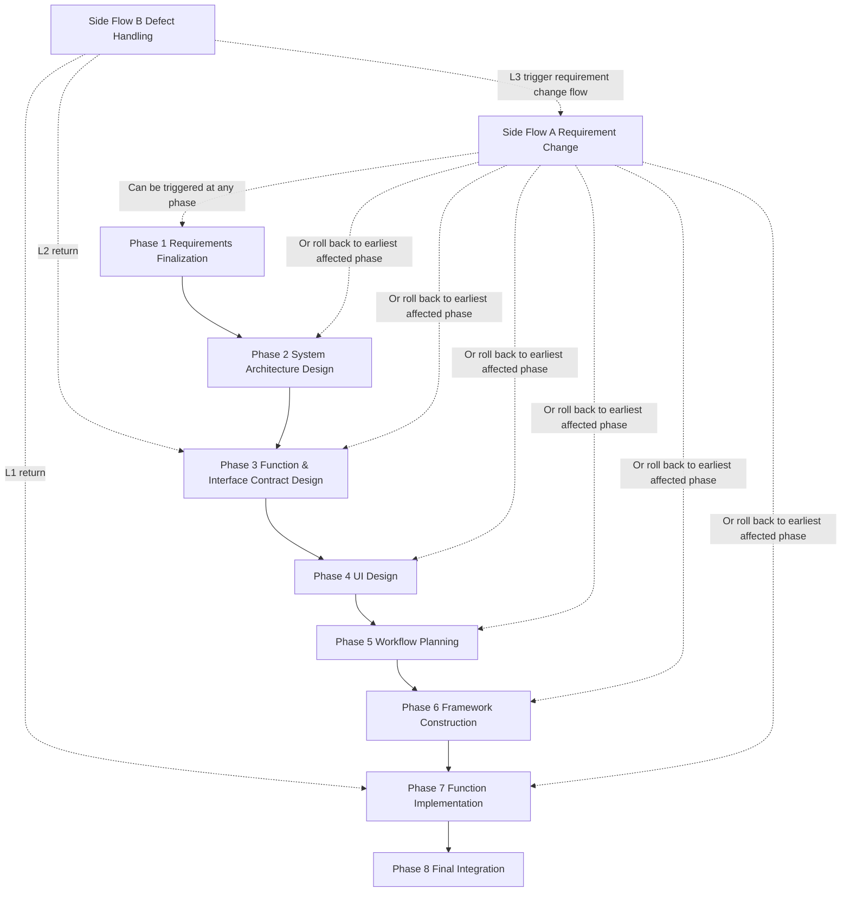

# Multi-Agent Collaborative Development Architecture

## Chapter 0: Preface

**Purpose**: This document targets AI system architects, Agent framework developers, and technical decision-makers, describing a multi-Agent collaborative development architecture for enterprise software R&D implementation. This document focuses on its process design, stage gating, parallelization strategies, and key mechanisms, serving as a reference for solution communication, architecture review, and subsequent prototype implementation.

---

## Chapter 1: Executive Summary

### 1.1 One-Sentence Definition
This document proposes a **Git-native, stage-gated, contract-first, clone-parallelized** multi-Agent collaborative development architecture that **decomposes the software R&D process into several reviewable, traceable, and rollback-capable stages**, addressing current pain points in Agent development workflows: **high rework cost, severe context pollution, untraceable state, and uncontrolled parallel development**.

### 1.2 Core Innovations
- **Stage Gating Mechanism**: Decomposes the development process into 8 main phases and 2 side flows; the next phase cannot proceed until the deliverables of the previous phase are locked.
- **Contract-First Mechanism**: Completes function and interface contract design before entering coding, providing boundaries for subsequent strong decoupling and large-scale parallel development.
- **Clone Parallelization Mechanism**: Splits the same role into multiple clones during the function implementation phase, enabling parallel progression at the function or fine-grained task level.
- **Experience Serialization Mechanism**: Experience is only accumulated and transferred between batches, not diffused in real-time within the same batch, thereby reducing context pollution.
- **Git-native State Management**: Uses Git branches, commits, temporary workspaces, and phase artifacts as the core state carriers, rather than relying on long context sessions to preserve system state.
- **Side Flow Governance Mechanism**: Separates "user requirement changes" and "internal system quality issues" through requirement change flow and defect handling flow, avoiding indiscriminate rework.

### 1.3 Applicable and Inapplicable Scenarios
**Applicable Scenarios**:
- Medium-to-large projects or medium-to-long cycle projects
- Projects with significant frontend-backend collaboration and complex interface dependencies
- Scenarios sensitive to development cost, rework cost, and process traceability
- Projects requiring multi-Agent division of labor rather than a single Agent with long context completion

**Inapplicable Scenarios**:
- One-off scripts, small demos, extremely short-cycle prototypes
- Scenarios with highly volatile requirements unwilling to perform upfront design
- Exploratory experiments with extremely fuzzy task boundaries where contracts and artifacts are difficult to solidify

---

## Chapter 2: Problem Background & Motivation

### 2.1 Pain Points in Current Agent Development Workflows
Many current Agent development approaches resemble "long conversation-driven coding". The main issue lies not in insufficient model capabilities, but in the lack of structured constraints in the process. Common problems include:

- **Proceeding to implementation before requirements converge**: Users often start development while requirements remain unclear, leading to large-scale rework.
- **Excessive coupling between design and implementation**: System architecture, interface design, UI design, and code implementation are mixed together, causing modification costs to increase rapidly.
- **Severe context pollution**: A single Agent handles requirements, design, coding, debugging, and other tasks within a long context, leading to state confusion and instruction drift.
- **Parallel development lacking boundaries**: When multiple Agents write code simultaneously, without contracts, dependency graphs, and merge rules, they easily overwrite each other or create hidden conflicts.
- **Untraceable state**: Many key decisions exist only in conversations, making it difficult to accurately track inputs, outputs, and modification reasons through version systems.

### 2.2 Limitations of Existing Solutions
Existing multi-Agent frameworks typically have some capability in "role splitting", but still show obvious shortcomings in "engineering governance":

- Most solutions emphasize role collaboration but lack strict stage gating, resulting in loose processes despite different roles.
- Most solutions rely on session state or memory state to maintain context, providing weak traceability in long-term projects.
- Most solutions support task parallelization but the parallelization granularity usually stays at the role or task level, lacking fine-grained control over function-level development boundaries.
- Requirement changes and defect fixes often lack separate governance mechanisms, forcing all issues to be handled through "continue modifying".

### 2.3 This Document's Solution Approach
To address the above problems, this document proposes a multi-Agent architecture centered on engineering processes rather than conversations. The core ideas are:

1. **First converge requirements, then design architecture and contracts, then proceed to implementation**;
2. **Replace fuzzy contexts with phase artifacts, replace implicit state memory with Git**;
3. **Allow large-scale parallel development only after clarifying dependency relationships and checkpoints**;
4. **Treat requirement changes and defect handling as two different types of problems, governed by different side flows**.

---

## Chapter 3: Core Concepts & Terminology

### 3.1 Glossary
- **Main Phase**: A fixed phase in the system's main development flow; there are 8 total, progressing sequentially.
- **Side Flow**: A governance flow that does not belong to the sequential main phases but can be triggered at any point, including the requirement change flow and defect handling flow.
- **Stage Gate**: The next phase cannot proceed until the deliverables of the previous phase are locked or pass review.
- **Artifact**: A formally produced document, code, diagram, or record from a certain phase, serving as the input basis for the next phase.
- **Contract**: Definition of inputs/outputs, invocation methods, constraints, and expected behavior for functions, interfaces, or modules.
- **Clone**: A parallel instance of the same role during the function implementation phase, typically occupying an independent workspace and corresponding to a Git branch.
- **Checkpoint**: A pre-designed review or integration point in the workflow planning phase, used to segment the development process.
- **Batch**: A collection of functions between two adjacent checkpoints, representing the smallest parallel progression unit in the function implementation phase.
- **Experience Pool**: A short-term memory container within the project, used to store development experiences and lessons learned from previous batches.
- **Main Agent**: The Orchestrator/Supervisor responsible for process orchestration and progression, scheduling roles, advancing phases, and recording state; not a specific business output role.
- **Logger**: An automated Agent responsible for briefly recording phase progression, review conclusions, change handling, and cost information.
- **Frontend-Backend Integration Specialist**: This name is retained in the main text, but its implementation can be split into multiple sub-capabilities such as architecture review, contract review, and integration verification.

### 3.2 Architectural Philosophy
This architecture follows these principles:

- **Define boundaries first, then allow parallelization**: No parallel development without contracts.
- **Lock artifacts first, then pass context**: Phase deliverables take precedence over session memory.
- **Local error correction before global rollback**: Prioritize handling problems within the smallest possible impact scope; large-scale rollback only occurs when architectural assumptions fail.
- **Minimal context provisioning**: Each Agent, especially clones, receives only the minimum context needed to complete the current task.
- **Process traceability over one-time efficiency**: Prefer adding small upfront design costs to avoid high-cost rework later.

---

## Chapter 4: System Architecture Design

### 4.1 Overall Flowchart

The overall flow consists of 8 main phases and 2 side flows. Main phases progress sequentially; side flows can interrupt or roll back the main flow under specific conditions. The system is not centered on "multi-Agent free discussion" but on "artifact-driven phase progression"; each Agent's role is to produce specific types of structured outputs within established phases.

### 4.2 Phase Details

#### 4.2.1 Requirements Finalization Phase
Since some users often lack clear PRD documentation when starting vibe coding, and sometimes even lack clear awareness of their own requirements and implementation difficulties, leading to major rework later, this phase is added.

**Skippable Cases**: The company already has PRD documentation, and user requirements are very clear. However, skipping does not mean missing artifacts; equivalent external input artifacts must be provided and still need to be accepted by the next phase.

**Involved Agent**: Requirements Analyst

**Specific Process**: The Requirements Analyst helps users clarify requirement boundaries through multiple rounds of systematic questioning, gradually converging original ideas into executable requirements. Questioning content should include but not be limited to:
- Core objectives and business value
- Target users and main usage scenarios
- Core functional and non-functional requirements
- Input/output forms
- Constraints and technical preferences
- Scope that needs to be explicitly excluded
- Potential risks and uncertainties

**Delivery Phase**:
- **Main Artifact**: A clear PRD document
- **Artifact Requirements**: The PRD document should include:
  - Project objectives and problem definition
  - Target users and typical scenarios
  - Functional scope and non-functional requirements
  - Boundary explanations and exclusion items
  - Acceptance criteria or success criteria
  - Key constraints and pending confirmation issues

- **Phase Conclusion**: After delivery, the Main Agent performs git commit, and the Logger makes brief records.

#### 4.2.2 System Architecture Design Phase
Any complex project requires clear architecture, hence this phase is added.

**Skippable Cases**: User provides clear architecture or requires using an existing available architecture. However, skipping still requires equivalent architecture input artifacts and must pass next-phase input validation.

**Involved Agents**: System Architect Designer, Frontend-Backend Integration Specialist

**Specific Process**: First provide the PRD document to the System Architect Designer for system design and technology selection, producing a system architecture document; then give the document to the Frontend-Backend Integration Specialist to review rationality and produce a pass/fail and modification opinion document (if not passed); iterate until passed or reach limit (default 3 times).

**Delivery Phase**:
- **Main Artifact**: A system architecture design document
- **Artifact Requirements**: The system architecture design document should include:
  - System overall objectives and design principles
  - Core module division and responsibility boundaries
  - Frontend-backend responsibility division
  - Data flow and key invocation chains
  - Technology stack selection and selection rationale
  - Deployment form or operational approach overview
  - Risk points, trade-offs, and pending concerns

- **Phase Conclusion**: Review-generated modification opinions should be stored in the temp folder; after delivery, the Main Agent performs git commit, and the Logger makes brief records.

#### 4.2.3 Function & Interface Contract Design Phase
To achieve strong decoupling in subsequent engineering, API and function specifications must be designed first.

**Tip: This is the most important part of the project. It is very difficult to implement with only one LLM, so we propose another experimental approach. See docs/recursive-decomposit and experiment/recursive-decomposition for details.**

**Involved Agents**: System Architect Designer, Frontend-Backend Integration Specialist

**Specific Process**: Have the System Architect Designer review the architecture document again and start stepwise interface design: first design frontend and backend interfaces separately, design each function's purpose and required external APIs, producing a function and interface specification document; then have the Integration Specialist review, confirm rationality, and iterate modifications; next, have the system expert explicitly design each function's input/output and specific functionality, producing a function and interface contract document; then have the Integration Specialist review whether frontend and backend interfaces align, confirm rationality, and iterate modifications.

**Delivery Phase**:
- **Main Artifact**: A function and interface contract document
- **Artifact Requirements**: The function and interface contract document should include:
  - Frontend interface list and usage description
  - Backend interface list and usage description
  - External API list and invocation boundaries
  - Input/output definitions for each function or interface
  - Error handling and exception return conventions
  - Data structures, field meanings, and constraint conditions
  - Frontend-backend mapping relationship descriptions
  - Constraints on immutable parts

- **Phase Conclusion**: Review-generated modification opinions should be stored in the temp folder; after delivery, the Main Agent performs git commit, and the Logger makes brief records.

#### 4.2.4 UI Design Phase
The UI design phase mainly allows users to better design interfaces that meet their preferences, improving user experience, while also providing clear design specifications and references for frontend development.

**Skippable Cases**: User provides explicit UI design HTML files or equivalent design input artifacts. However, skipping must ensure subsequent frontend phases can directly consume these inputs.

**Involved Agent**: UI Designer

**Specific Process**: First, the UI Designer will analyze interfaces involving frontend interaction based on the PRD document, system architecture design document, and interface contract document; then inquire about the user's design preferences, select style, fonts, colors, and other design elements, and start page-by-page design; the UI Designer only designs interfaces, leaving all interactive functions empty; after each page's UI HTML is written, it will be reviewed by the user for confirmation; if not meeting expectations, modifications are made based on user feedback; after all pages are designed, the UI Designer produces a UI design document explaining each page's design rationale and details.

**Delivery Phase**:
- **Main Artifact**: A UI design document, and UI HTML files for each page
- **Artifact Requirements**: The UI design document should include:
  - Page list and page purposes
  - Design style description
  - Visual element conventions (fonts, colors, spacing, component styles, etc.)
  - Page navigation relationships
  - Placeholder descriptions for interface-related interactions
  - Modification records after user review

    UI HTML files should meet the following requirements:

- Clear page structure, directly usable as frontend implementation reference
- All interactive entry points identified but business functions not implemented
- Complete style expression, easy for subsequent frontend filling
- File naming consistent or mappable to page names

- **Phase Conclusion**: After delivery, the Main Agent performs git commit, and the Logger makes brief records.

#### 4.2.5 Workflow Planning Phase
Workflow planning mainly provides strict references for subsequent parallel development, avoiding duplicate or omitted development, while also allowing users to clearly understand development progress and flow.

**Involved Agents**: Workflow Planner, System Architecture Expert

**Specific Process**: First, the Workflow Planner will clarify dependency relationships of all functions and interfaces based on previous documents, constructing a function dependency graph; then divide the workflow into two phases: Framework Construction Phase and Function Implementation Phase; the Framework Construction Phase sets up the project main framework, using all functions and interfaces but with no concrete implementations inside functions; the Function Implementation Phase arranges function development order based on the dependency graph, designing two types of checkpoints: code review checkpoints and frontend-backend integration checkpoints; after complete process design, produce a workflow design document, which should be reviewed by the System Architecture Expert for rationality and iterative modifications (default maximum 3 times).

**Delivery Phase**:
- **Main Artifact**:
  - A workflow design document
  - A function dependency graph
  - A checkpoint schedule
  - A batch division table
- **Artifact Requirements**: The workflow design document should include:
  - Overall progression order of modules and functions
  - Frontend-backend parallel relationship descriptions
  - Function dependency relationship descriptions
  - Basis for code review checkpoint and integration checkpoint settings
  - Progression rules for the Framework Construction Phase
  - Batch segmentation principles for the Function Implementation Phase
  - Prerequisites and completion criteria for each batch

- **Phase Conclusion**: Review-generated modification opinions should be stored in the temp folder; after delivery, the Main Agent performs git commit, and the Logger makes brief records.

#### 4.2.6 Framework Construction Phase
The Framework Construction Phase mainly sets up the project's main framework, preparing for large-scale parallel development in subsequent function implementation.

**Involved Agents**: Frontend Developer Engineer, Backend Developer Engineer, Code Reviewer

**Specific Process**: Frontend and backend engineers build the project framework in parallel based on the workflow design document and interface documents; frontend must also follow UI-developed HTML for filling; main tasks of the Framework Construction Phase are: frontend completes page skeletons, component wiring, and lightweight interactive logic; backend completes the main code framework; all functions/interfaces should be established but with internal logic all pass or equivalent placeholders, ensuring system runs without errors; any functions/interfaces can be used but must follow contract documents; when reaching review checkpoints, conduct code review to confirm framework rationality; if not rational, modify based on feedback (default maximum 3 times).

**Allowed Frontend Lightweight Logic**:
- Page navigation
- Local form validation
- Interface states like loading, disabled states, modal open/close
- Dummy data placeholders and static state switching

**Disallowed Content**:
- Implementing real business functions from contract documents
- Connecting real business processing logic
- Extending interface behavior beyond contract boundaries

**Delivery Phase**:
- **Main Artifact**: Framework-constructed code (frontend, backend)
- **Artifact Requirements**: Framework-constructed code should meet the following requirements:
  - Complete project directory structure
  - All functions and interfaces from contracts are established
  - System is runnable, but business logic remains empty or placeholder implementations
  - Frontend pages consistent with or mappable to UI design drafts
  - Backend module boundaries clear, ready for direct integration by subsequent clone development

- **Phase Conclusion**: Review-generated modification opinions should be stored in the temp folder; after delivery, the Main Agent performs git commit, and the Logger makes brief records.

#### 4.2.7 Function Implementation Phase
The Function Implementation Phase is the core phase of the entire development process, implementing functions based on previous design documents, following the workflow and order planned in the workflow design document. Since clear design and planning already exist, this phase enables large-scale parallel development, greatly improving development efficiency.

**Involved Agents**: Frontend Developer Engineer, Backend Developer Engineer, Code Reviewer, Frontend-Backend Integration Specialist, Experience Consolidator

**Specific Process**: According to the workflow document, segment the function development process into multiple batches based on checkpoints; for each batch, create "Agent clones" for frontend and backend engineers: each clone occupies a temporary workspace, copies current development context from the main codebase, and is responsible for developing one or several functions in an independent Git branch; each clone receives experience from previous batches, relevant function contract document fragments, and partial main code framework for maintaining code style; each clone develops independently, then submits to a Code Reviewer clone for review; the Code Reviewer clone conducts code review, confirms function implementation rationality; if not rational, modify based on feedback (default maximum 3 times); if passed, merge the branch into main; however, main here primarily serves as a code repository, not as a real-time context source for subsequent clones; the engineer and reviewer clones should briefly summarize experience and place it in the experience pool at the end of the round, then their context lifecycle ends; when reaching frontend-backend integration checkpoints, perform integration to observe if code operates normally.

**Batch (Batch) & Checkpoint Mechanism**:

This phase adopts a "checkpoint segmentation, batch parallelization, experience serialization" strategy:

- **Checkpoint**: Determined by Phase 5 based on function dependency graph, dividing the development process into multiple logical segments
- **Batch**: All functions between two adjacent checkpoints constitute a batch
- **Parallelization Scope**: All functions within the same batch are developed simultaneously
- **Experience Boundary**: Clones can only obtain experience snapshots from previous batches; current batch experience is only organized and stored after the batch ends

**Modification Constraints (Hard Limits)**:
- Allowed: Side-effect-free operations within functions
- Allowed: Adding local private helpers, local imports, or local structures serving only the current function's implementation within whitelist areas
- Prohibited: Modifying function signatures, decorators, docstrings, import main structure, class structures, or affecting other functions
- Violation Handling: Static checks before merging; if boundary violations detected, forcibly roll back the clone to the framework version, marked as "requires manual intervention"

**Delivery Phase**:
- **Main Artifact**: Function-implemented code (frontend, backend)
- **Artifact Requirements**: Function-implemented code should meet the following requirements:
  - All functions from contracts are implemented
  - Each batch's code passes corresponding review checkpoints
  - Frontend-backend can complete established integration at integration checkpoints
  - No unauthorized modifications to other functions or structures
  - Batch experience is organized and available for subsequent phases

- **Phase Conclusion**: Each clone should occupy a temporary workspace; review-generated modification opinions should be stored in that workspace's temp folder, and the workspace should be deleted when the clone's context lifecycle ends; generated experience is placed in the designated experience pool and organized by the Experience Consolidator; after delivery, the Main Agent performs git commit, and the Logger makes brief records.

#### 4.2.8 Final Integration Phase
The Final Integration Phase is the final phase of the entire development process, integrating all previously developed features for comprehensive testing and debugging, ensuring system stability and reliability.

**Involved Agent**: Frontend-Backend Integration Specialist

**Specific Process**: The Frontend-Backend Integration Specialist integrates all previously developed features for comprehensive testing and debugging, ensuring system stability and reliability; if issues are found, produce feedback documentation and follow the defect handling flow for modifications; if no issues, proceed with final delivery, producing final delivery documentation explaining the system's overall situation and usage instructions.

**Delivery Phase**:
- **Main Artifact**: A final delivery document, and final version code
- **Artifact Requirements**: The final delivery document should include:
  - System overall completion status
  - Major feature acceptance conclusions
  - Known limitations and unresolved issues
  - Deployment or operation instructions
  - Future maintenance recommendations

- **Phase Conclusion**: After delivery, the Main Agent performs git commit, and the Logger makes brief records.

#### 4.2.9 Non-Phase Flows

##### 4.2.9.1 Requirement Change Flow
The Requirement Change Flow handles new requirements or requirement modifications proposed by users during development. Unlike defect handling, this flow addresses "external input changes" rather than internal quality issues.

**Trigger Conditions**: User proposes new functional requirements, modifies existing requirements, or adjusts technical constraints at any phase.

**Involved Agents**: Change Assessor, Main Agent, Logger, relevant phase Agents

**Specific Process**:
1. **Recording & Assessment**: After receiving the change request, the Main Agent immediately calls the Change Assessor; the assessor reads Logger records and current phase documents to determine change impact scope.
2. **Impact Classification**: The assessor classifies changes into three levels:
   - **G-level (Severe)**: Affects core architectural design or multiple completed phases
   - **M-level (Medium)**: Affects UI design or API contracts
   - **S-level (Minor)**: Local adjustments like modifying text, styles, small-scope behavior
3. **Handling Decisions**:
   - **G-level**: Recommend rejecting the change; if user insists, create a new Git branch `refactor-xxx`, restarting from the earliest affected phase
   - **M-level**: Accept change, create `change-m-xxx` branch, only re-executing affected phases
   - **S-level**: Quick fix, coordinated directly by the Main Agent with currently available Agents, no need to restart full phases
4. **Execution & Recording**: Execute change according to decision, Logger records change log including change content, impact scope, and added cost.

**Delivery Phase**:
- **Main Artifact**: Change assessment report + updated relevant phase documents
- **Artifact Requirements**:
  - Change assessment report should include: classification result, impact analysis, cost estimation, execution recommendation
  - For G-level with user insistence, user confirmation document required
  - Updated documents replace old versions but preserve Git history
- **Phase Conclusion**: After change completion, the Main Agent performs Git commit, and the Logger records the entire change handling process.

##### 4.2.9.2 Defect Handling Flow
The Defect Handling Flow handles code quality issues discovered during testing or development. Unlike requirement changes, this flow addresses "internal implementation errors", following the "cost minimization" principle to avoid triggering full change assessment.

**Trigger Conditions**: Phase 8 test failures, or Phase 6/7 development where Agent discovers design cannot be implemented.

**Involved Agents**: Defect Classification Expert (can be concurrently held by Frontend-Backend Integration Specialist), Code Reviewer, relevant development Agents

**Specific Process**:
1. **Defect Classification**: Expert classifies defects into three levels based on nature:
   - **L1 (Implementation Defect)**: Code logic errors, unhandled boundary conditions, performance not meeting standards, but function input/output conforms to contract
   - **L2 (Contract Defect)**: Contract design unreasonable, but architecture itself feasible
   - **L3 (Architecture Defect)**: Technology selection errors, core assumptions invalid
2. **Level-Based Handling**:
   - **L1 Handling**: Directly return to Phase 7, create a repair clone, continue modifications based on original context, only requiring Code Reviewer check before merging
   - **L2 Handling**: Pause related development in current batch, return to Phase 3 to revise contract documents; after modification, uncompleted functions need context updates, completed functions need compatibility checks; create `hotfix-contract` branch for handling
   - **L3 Handling**: Trigger Requirement Change Flow, handled as G-level
3. **Experience Accumulation**: After defect repair, the Experience Consolidator records defect type, cause, and repair solution in the experience pool as reference for subsequent development.

---

## Chapter 5: Key Mechanisms Explained

### 5.1 Checkpoint Mechanism
Problem discovery should follow the principle "earlier discovery, lower cost correction". Therefore, the checkpoint mechanism is designed in the Workflow Planning Phase to timely discover and correct issues during development, avoiding accumulation until the Final Integration Phase. Checkpoints are not simple time segmentation but governance nodes set around dependency relationships, module boundaries, and integration risks.

### 5.2 Function Interface First Mechanism
The Function Interface First Mechanism ensures clear development specifications and references during the Function Implementation Phase, guaranteeing correctness and efficiency of function development. By designing function interfaces and contracts before the Function Implementation Phase, providing clear guidance and specifications for subsequent function development. More importantly, this enables large-scale parallel development in the Function Implementation Phase, as each function's interface and contract are already clear, allowing development clones to progress independently within stable boundaries.

### 5.3 Clone Mechanism
The Clone Mechanism is designed for large-scale parallel development in the Function Implementation Phase. By creating independent clones for one or more functions, different development instances can advance concrete implementations simultaneously without sharing full context. Clones are not long-lived roles but temporary execution units created and destroyed around batch tasks.

### 5.4 Experience Management Mechanism
Since clones are introduced, context provisioning for clones becomes crucial; therefore, we design the Experience Management Mechanism to ensure each clone can obtain experience accumulation from previous batches, thereby better conducting function development. Simultaneously, the Experience Management Mechanism helps the system organize and summarize experience generated across batches, providing references for subsequent phases within this project. This experience pool only serves within the project, not as a cross-project long-term knowledge base.

### 5.5 Git Mechanism
Since the project involves large-scale parallel development and multiple clones, the Git Mechanism is designed to ensure each clone has an independent workspace and can perform version management and code merging through Git, ensuring code quality and state traceability. The key here is not just "using Git", but making Git the main state carrier: phase commits, batch code, change rollbacks, and defect fixes should all be traceable through Git history.

### 5.6 Phase Skipping Mechanism
The core principle of the Phase Skipping Mechanism is: **The process can be skipped, but input boundaries cannot be omitted**. When external equivalent input artifacts are already provided, the corresponding phase can be skipped, but the system's input requirements for that phase must not be omitted. External input artifacts still need to be accepted by the next phase; otherwise, return to the corresponding phase to re-produce artifacts.

### 5.7 Side Flow Governance Mechanism
Requirement changes and defect handling are fundamentally two different problems: the former originates from external input changes, the latter from internal implementation deviations. Without distinction, the system tends to treat all anomalies as "continue modifying", leading to phase pollution and uncontrolled rework. Therefore, this architecture extracts both from the main flow, designing them as pluggable, rollback-capable, traceable side governance flows.

---

## Chapter 6: Agent Configuration Specifications

### 6.1 Agent Role Definitions

| Name | Core Responsibilities | Trigger Conditions | Main Inputs | Main Outputs | Tool Permission Tendency |
|------|----------------------|-------------------|-------------|--------------|--------------------------|
| Main Agent | Responsible for orchestration, phase progression, and role coordination | At start or end of any phase | Current phase status, historical records | Scheduling instructions, phase advancement | Read / Dispatch / Commit |
| Logger | Records phase and flow summaries | At each phase conclusion, change, or defect handling | Current processing results | Brief logs | Write Log |
| Requirements Analyst | Converges requirements and forms PRD | Phase 1 | User ideas, constraints | PRD document | Read / Write |
| System Architect Designer | Designs system architecture and contracts | Phase 2, 3 | PRD, historical design documents | Architecture design document, contract document | Read / Write |
| Frontend-Backend Integration Specialist | Responsible for cross-end consistency review and integration | Phase 2, 3, 7, 8 | Architecture, contracts, code | Review opinions, integration results | Read / Review |
| UI Designer | Produces page designs and frontend visual specifications | Phase 4 | PRD, architecture, contracts | UI design document, page html | Read / Write |
| Workflow Planner | Plans dependencies, checkpoints, and batches | Phase 5 | Contract documents, architecture documents | Workflow design document, dependency graph | Read / Write |
| Frontend Developer Engineer | Completes frontend framework and function implementation | Phase 6, 7 | UI, contracts, code framework | Frontend code | Read / Write Code |
| Backend Developer Engineer | Completes backend framework and function implementation | Phase 6, 7 | Architecture, contracts, code framework | Backend code | Read / Write Code |
| Code Reviewer | Reviews framework and function implementations | Phase 6, 7 | Code, contracts, review rules | Review opinions, pass conclusions | Read / Review |
| Experience Consolidator | Consolidates batch experience and defect lessons | Phase 7, side flows | Batch summaries, repair records | Experience pool updates | Read / Write Summary |
| Change Assessor | Assesses requirement change impact and classification | Triggered by requirement change | Current documents, logs | Change assessment report | Read / Analyze |
| Defect Classification Expert | Identifies defect levels and rollback strategies | Triggered by defect handling | Test results, code, contracts | Defect classification result | Read / Analyze |

This architecture does not attempt to strictly limit to a fixed number of roles, but acknowledges it as a **system with over 9 roles**. Some roles can be merged in implementation, while others can appear as sub-capabilities in higher-level orchestration systems.

### 6.2 Configuration Specification Notes
This document currently only discusses role boundaries and responsibility division, not expanding into specific YAML or frontmatter configurations. The reason is: the current phase goal is to clarify architectural conception and communication interfaces, not freeze implementation details. If entering prototype implementation phase later, this chapter can be converged into executable configuration specifications.

Current recommended configuration layer should cover at least the following information:
- Role name and unique identifier
- Triggerable phases
- Core responsibility description
- Input/output constraints
- Whether allowed to write code, write documents, write logs
- Whether allowed to review or reject upstream artifacts
- Whether allowed to access historical experience or batch experience

### 6.3 Tool Permission Model
Tool permissions should be strictly bound to role responsibilities, not default open.

- **Code read-only roles**: Such as Integration Specialists, Defect Classification Experts, more suitable for analysis, review, and judgment responsibilities, avoiding direct modification of locked artifacts (but allowed to write review documents).
- **Document-writing roles**: Such as Requirements Analysts, Architect Designers, UI Designers, Workflow Planners, should only write artifacts for their phase, should not overstep to modify code.
- **Code-writing roles**: Frontend and Backend Developer Engineers can modify code within limited workspaces and boundaries, but must not modify structures beyond contracts.
- **Review roles**: Code Reviewers and Integration Specialists should have rejection authority, but whether allowed to directly fix should be decided separately during implementation phase.
- **Orchestration roles**: The Main Agent should be responsible for invocation and progression, not directly undertaking output responsibilities of specialized roles.

The core purpose of permission design is not to "limit capabilities", but to **limit unauthorized modifications**. Especially with phase locking and parallel development, if role permissions are too broad, the system can easily bypass upfront design, regressing to disordered conversational development.

---

## Chapter 7: Comparison with Existing Solutions

### 7.1 Comparison Dimensions

| Dimension | This Architecture | MetaGPT | AutoGen | CrewAI |
|-----------|-------------------|---------|---------|--------|
| Basic Positioning | Stage-based multi-Agent architecture for software R&D governance | SOP-driven multi-role collaboration framework | General multi-Agent application framework | Production workflow and automation oriented multi-Agent framework |
| Core Abstraction | Phase, artifact, contract, batch, clone | Role, SOP, software company process metaphor | Agent, Team, Core, event-driven workflows | Agent, Crew, Flow, task processes |
| Phase Control | Strong stage gating, artifact-driven progression | Has process orientation, but built-in stage gating relatively weak | Primarily programming orchestration, no default strong stage gating | Emphasizes process and automation, but not strict stage gating for software R&D |
| Cost Optimization Approach | Controls cost through contract-first, checkpoints, and clone boundaries | Organizes tasks through SOP and role division | Achieves control through flexible orchestration and runtime abstractions | Manages execution through processes, guards, and observability |
| State Traceability | Git-native | Mainly relies on framework process and artifacts | Strong runtime and component-level abstraction | Strong process and platform capabilities |
| Parallelization Granularity | Function-level / clone-level | Role-level / process-level | Conversation-level / component-level / workflow-level | Task-level / process-level |
| Requirement Change Governance | Built-in side flow | Non-core feature | Requires custom orchestration | Requires custom design |
| Defect Rollback Governance | Built-in hierarchical rollback | Non-core feature | Requires custom orchestration | Requires custom design |
| Suitable Focus | Medium-to-large R&D projects | Role-based task collaboration and software company-style processes | Building general multi-Agent systems | Building production automation and process systems |
| Implementation Maturity | Technical conception phase | Existing open-source implementation | Relatively mature framework system | Relatively mature framework and platform system |

### 7.2 Advantage Analysis
Compared to existing mainstream solutions, this architecture's advantage does not lie in "more Agents" or "richer roles", but in explicitly treating **engineering governance** as a first-class citizen.

- Compared to role-collaboration-oriented solutions, this architecture emphasizes artifact locking, phase progression, and side flow governance, more suitable for R&D scenarios requiring long-term maintenance and process traceability.
- Compared to general-orchestration-oriented frameworks, this architecture provides more specific structural constraints for software development-specific issues, such as contract-first, function-level boundary control, batch parallelization, and defect rollback.
- Compared to automation-platform-oriented solutions, this architecture focuses more on "how the R&D process itself is decomposed and governed", not just task execution and integration capabilities.

### 7.3 Disadvantages & Trade-offs
This architecture also has significant costs, its value built upon upfront governance investment:

- **Higher startup cost**: Must go through upfront phases like requirements, architecture, contracts, workflows; unsuitable for scenarios pursuing immediate output.
- **Higher implementation complexity**: Clones, batches, workspaces, whitelist modifications, side flow governance all require additional implementation costs.
- **Higher requirements for role compliance capability**: If underlying models cannot stably adhere to boundaries, architectural advantages are weakened.
- **Dependency on documentation quality**: If upfront artifacts are of low quality, all subsequent parallel development is affected.

Therefore, this architecture is more suitable as a **technical conception and governance framework for complex R&D processes**, not a general Agent product solution pursuing minimal onboarding and quick results.